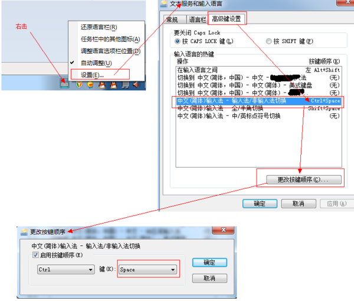

# git的三种状态
1. staged(已经commit) unstaged(add后没有commit) unresolved(冲突未解决)

# vscode快捷键被占用 情况
1. ctrl + shift + up/down 被桌面图形选项卡快捷键占用
    桌面右键-- 图形选项 -- 快捷键 -- 禁用
2. ctrl + space 强制智能提示快捷键 被切换输入法的快捷键占用；更改如下图；

